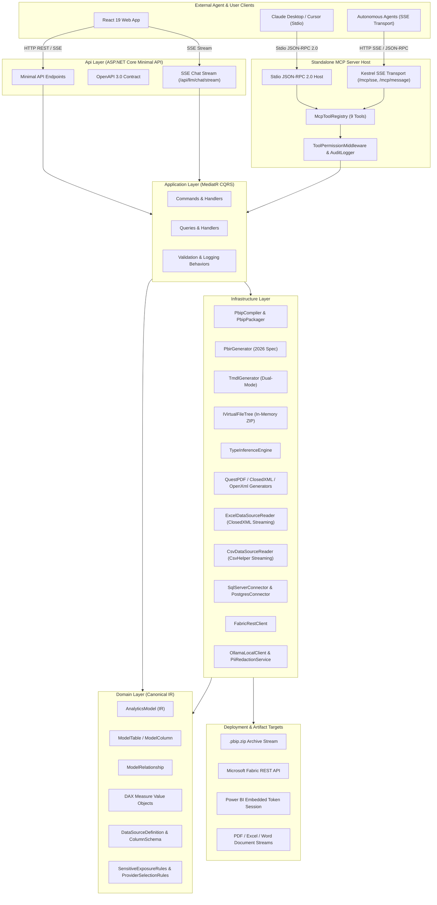

# Enterprise Power BI Analytics Platform

[](https://dotnet.microsoft.com/)
[](https://react.dev/)
[](https://www.typescriptlang.org/)
[](https://learn.microsoft.com/power-bi/developer/projects/projects-overview)
[](#system-architecture)
[-229%2F229%20Passed-success)](#backend-test-taxonomy)
[-67%2F67%20Passed-success)](#frontend-test-taxonomy)

A high-performance, enterprise-grade analytics framework that treats Power BI reports and semantic models as **compiled software artifacts**. Built on .NET 10 LTS and React 19, the platform generates valid 2026 Power BI Enhanced Report Format (`PBIR`), Tabular Model Definition Language (`TMDL`), and complete `.pbip` project packages directly from a canonical C# Intermediate Representation (IR), accompanied by an enterprise Model Context Protocol (MCP) server for autonomous AI agents.

---

## Table of Contents

- [System Architecture](#system-architecture)
- [Core Engines & Capabilities](#core-engines--capabilities)
  - [1. Power BI PBIP & TMDL Compiler Engine](#1-power-bi-pbip--tmdl-compiler-engine)
  - [2. Multi-Source Ingestion Engine](#2-multi-source-ingestion-engine)
  - [3. React 19 Visual Authoring Canvas](#3-react-19-visual-authoring-canvas)
  - [4. Multi-Target Document Generation Engine](#4-multi-target-document-generation-engine)
  - [5. Standalone Model Context Protocol (MCP) Server & LLM Assistant](#5-standalone-model-context-protocol-mcp-server--llm-assistant)
  - [6. AI Advisory Tier & Governed Decision Support](#6-ai-advisory-tier--governed-decision-support)
- [Monorepo Directory Structure](#monorepo-directory-structure)
- [Clean Architecture & Dependency Rules](#clean-architecture--dependency-rules)
- [API & MCP Tool Reference](#api--mcp-tool-reference)
- [Testing Taxonomy](#testing-taxonomy)
  - [Backend Test Taxonomy (6 Categories)](#backend-test-taxonomy)
  - [Frontend Test Taxonomy (5 Categories)](#frontend-test-taxonomy)
- [Getting Started](#getting-started)
  - [Prerequisites](#prerequisites)
  - [Backend Setup & Run](#backend-setup--run)
  - [Running the Standalone MCP Server](#running-the-standalone-mcp-server)
  - [Frontend Setup & Run](#frontend-setup--run)
- [License](#license)

---

## System Architecture



---

## Core Engines & Capabilities

### 1. Power BI PBIP & TMDL Compiler Engine
- **2026 Enhanced Report Format (`PBIR`)**: Generates modular PBIR structures including `definition.pbir`, `definition/report.json` with active themes, `definition/pages/pages.json`, per-page `page.json` with layout bounds, and per-visual `visual.json` with structured `queryState` projection bindings.
- **Dual-Mode TMDL Generator**: Emits `definition.pbism` (v4.0), `definition/model.tmdl`, `definition/relationships.tmdl`, and granular `definition/tables/<table_name>.tmdl`. Supports both full Power Query M partition scripts when data sources are connected and schema-only tabular structures.
- **In-Memory Virtual File Tree**: Employs an `IVirtualFileTree` abstraction that builds full project trees in memory with directory traversal security guards (`..` prevention) and streams `.pbip.zip` archives directly to the client with zero disk I/O contention.

### 2. Multi-Source Ingestion Engine
- **ClosedXML Streaming Reader**: Ingests Excel workbooks in memory-safe batches of 1,000 rows via `IAsyncEnumerable<IReadOnlyList<IDictionary<string, object?>>>`.
- **CsvHelper Streaming Reader**: Non-blocking asynchronous CSV parsing without unbounded memory consumption.
- **Dual-Strategy SQL Schema Extractor**: Primary extraction via `SqlDataReader.GetSchemaTable(CommandBehavior.SchemaOnly)` for instant metadata without data row transfer; automatic fallback to `INFORMATION_SCHEMA.COLUMNS` with parameterized query isolation.
- **Mathematical Type Inference Engine**: Accurately differentiates whole numbers stored in OpenXML IEEE-754 format (`d % 1 == 0`) from fractional decimals, detects ISO-8601 datetimes, booleans, and strings, and captures nullable flags and first 5 distinct sample values.

### 3. React 19 Visual Authoring Canvas
- **Feature-Sliced Design (FSD)**: Strict architectural isolation across `app/`, `features/`, `entities/`, and `shared/` slices.
- **Custom Layout Builder**: Real-time canvas positioning, coordinate calculation, and Power BI layout serialization.
- **Live Embed Token Management**: Seamless integration with the official `powerbi-client` SDK for interactive report rendering.

### 4. Multi-Target Document Generation Engine
- **High-Fidelity PDF Engine**: Vector-rendered executive report documents via QuestPDF, including dynamic metadata blocks, headers, tabular summaries, and formula injection protection.
- **ClosedXML Multi-Tab Excel Engine**: Memory-efficient tabular workbook export with automatic formula character sanitization (`=`, `+`, `-`, `@`, `\t`, `\r`) to mitigate spreadsheet injection attacks.
- **OpenXML Word Engine**: High-fidelity `.docx` generation directly conforming to OpenXML WordprocessingML specifications.

### 5. Standalone Model Context Protocol (MCP) Server & LLM Assistant
- **Dual Protocol Transports**: Supports both Stdio JSON-RPC 2.0 (for Claude Desktop, Cursor, and CLI autonomous agents) and Kestrel SSE transport (`/mcp/sse` and `/mcp/message`) for containerized cluster environments.
- **9 Domain-Safe Tool Adapters**: All MCP tools execute strictly through `AnalyticsPlatform.Application` MediatR commands and queries, preserving Clean Architecture boundaries.
- **Fine-Grained Security & Permission Middleware**: `ToolPermissionMiddleware` inspects caller privilege (e.g., Fabric publishing restricted to privileged callers) and sensitivity rules (`SensitiveExposureRules`) before tool dispatch.
- **Real-Time Token Streaming**: SSE chat streaming endpoint (`POST /api/llm/chat/stream`) with local Ollama fallback, PII redaction, and React 19 `ChatStream.tsx` & `ToolExecutionBadge.tsx` frontend assistant components.

### 6. AI Advisory Tier & Governed Decision Support
- **Read-Only Invariant**: The advisory tier NEVER mutates, writes, approves, or executes changes in Data Quality & Transformation Engine (DQTE), Domain, or Power BI pipelines.
- **Strict Least-Privilege Exposure Control**: Implements a non-overridable ceiling where `Restricted` data is NEVER transmitted to any LLM. `Sensitive/Confidential` data requires explicit, audited `DataSteward` elevation and forces local execution via `LocalOllama` with strict PII masking.
- **Grounded Citation Explainability**: Every synthesized response references verified deterministic DQTE rule IDs (e.g., `ExactHashDedupe`, `SimilarityClusterDedupe`, `TypeCoercionRule`) and run IDs present in the assembled context.
- **GroundedAdvisorySynthesizer Fallback**: Deterministic heuristic engine that constructs grounded narrative explanations directly from DQTE rule telemetry when external LLMs are offline, ensuring 100% verifiable advisory explanations.

---

## Monorepo Directory Structure

```
D:\PowerBIEnhanced\
├── .editorconfig                          # Cross-editor formatting standards
├── .gitignore                             # Enterprise ignore rules (.NET 10, Vite, Playwright)
├── CODEOWNERS                             # Code ownership definitions
├── README.md                              # Main platform documentation
├── shared-contracts/
│   ├── openapi.yaml                       # Single-source-of-truth OpenAPI 3.0 specification
│   └── generated-types/                   # Auto-generated TypeScript contract definitions
├── backend/
│   ├── AnalyticsPlatform.slnx             # Modern .NET XML-based solution manifest
│   ├── Directory.Build.props              # Solution-wide compiler & analyzer rules
│   ├── Directory.Packages.props           # Central Package Management (CPM)
│   ├── src/
│   │   ├── AnalyticsPlatform.Domain/      # 0 external deps; Canonical IR, LLM & AI Advisory rules
│   │   ├── AnalyticsPlatform.Application/ # MediatR commands, queries, advisory context assembler
│   │   ├── AnalyticsPlatform.Infrastructure/# Compilers, connectors, advisory tools & synthesizers
│   │   ├── AnalyticsPlatform.Api/         # Minimal API endpoints & OpenAPI mapping
│   │   └── AnalyticsPlatform.McpServer/   # Standalone MCP Server (Stdio & SSE Transports)
│   └── tests/
│       ├── AnalyticsPlatform.UnitTests/   # Fast isolated domain & handler tests (131 tests)
│       ├── AnalyticsPlatform.IntegrationTests/# WebApplicationFactory & endpoint tests (29 tests)
│       ├── AnalyticsPlatform.PathTests/   # In-memory workflow & advisory path tests (8 tests)
│       ├── AnalyticsPlatform.RegressionTests/# Golden schema snapshots & redaction tests (20 tests)
│       ├── AnalyticsPlatform.SecurityTests/# Architecture, exposure & traversal tests (35 tests)
│       └── AnalyticsPlatform.E2ETests/    # HTTP round-trip & Reqnroll BDD tests (6 tests)
├── frontend/
│   ├── package.json                       # React 19.3 + TypeScript 5.8 + Vite
│   ├── vite.config.ts                     # Vite configuration & path aliases
│   ├── tsconfig.json                      # Strict TypeScript compiler options
│   ├── src/
│   │   ├── app/                           # Application entrypoint & providers
│   │   ├── features/                      # Business slices (powerbi-embed, data-sources, llm-assistant)
│   │   ├── entities/                      # Business models (dashboards, metrics)
│   │   └── shared/                        # UI components, HTTP client, generated types
│   └── tests/                             # Vitest suite (Unit, Integration, Path, Regression, Security)
└── infra/
    ├── docker/                            # Multi-stage Dockerfiles (API, McpServer, Ollama)
    ├── k8s/                               # Kubernetes manifests & kustomization overlays
    └── terraform/                         # Cloud infrastructure definitions
```

---

## Clean Architecture & Dependency Rules

The backend strictly adheres to Clean Architecture principles, enforced continuously via automated architecture tests using `NetArchTest.Rules`:

```
┌─────────────────────────────────┐       ┌─────────────────────────────────┐
│            Api Layer            │       │       McpServer Host            │
│  (Composition Root & Endpoints) │       │   (Stdio & SSE MCP Transports)  │
└────────────────┬────────────────┘       └────────────────┬────────────────┘
                 │ references                              │ references
                 └────────────────┬────────────────────────┘
                                  │
┌─────────────────────────────────▼─────────────────────────────────────────┐
│                            Application Layer                              │
│                    (MediatR, Interfaces, CQRS Handlers)                   │
└─────────────────────────────────┬─────────────────────────────────────────┘
                                  │ references
┌─────────────────────────────────▼─────────────────────────────────────────┐
│                               Domain Layer                                │
│                   (0 External Dependencies, Pure C# IR)                   │
└───────────────────────────────────────────────────────────────────────────┘
                                  ▲
                                  │ implements interfaces
┌─────────────────────────────────┴─────────────────────────────────────────┐
│                           Infrastructure Layer                            │
│           (PBIP/PBIR, TMDL, Connectors, Repositories, Ollama)             │
└───────────────────────────────────────────────────────────────────────────┘
```

- **Domain Layer (`AnalyticsPlatform.Domain`)**: Contains zero external NuGet package dependencies. Encapsulates `AnalyticsModel`, `ModelTable`, `ModelColumn`, `ModelRelationship`, `Measure`, `ColumnSchema`, and `SensitiveExposureRules`.
- **Application Layer (`AnalyticsPlatform.Application`)**: Depends only on Domain. Defines `IVirtualFileTree`, `IPbirGenerator`, `ITmdlGenerator`, `IPbipCompiler`, `IDataSourceSchemaExtractor`, and MediatR handlers.
- **Infrastructure Layer (`AnalyticsPlatform.Infrastructure`)**: Implements Application interfaces using `ClosedXML`, `CsvHelper`, `Microsoft.Data.SqlClient`, `Npgsql`, `QuestPDF`, and `OllamaLocalClient`.
- **Api Layer (`AnalyticsPlatform.Api`)**: Minimal API mapping, Serilog structured logging, and OpenAPI generation.
- **McpServer Layer (`AnalyticsPlatform.McpServer`)**: Standalone MCP Host implementing the Model Context Protocol (2024-11-05 spec) with Stdio JSON-RPC 2.0 and Kestrel SSE endpoints. Dispatches exclusively through Application commands/queries without domain leaks.

---

## API & MCP Tool Reference

### REST API Endpoints

| Method | Route | Description | Request Body | Response |
|---|---|---|---|---|
| `POST` | `/api/powerbi/compile-pbip` | Compiles complete `.pbip` project manifest | `CompilePbipProjectCommand` | `200 OK` (JSON manifest) |
| `POST` | `/api/powerbi/compile-pbip/download` | Compiles and streams `.pbip.zip` archive | `DownloadPbipPackageQuery` | `200 OK` (`application/zip`) |
| `POST` | `/api/powerbi/compile-pbir` | Compiles 2026 PBIR definition files | `CompilePbirDefinitionCommand` | `200 OK` (JSON file collection) |
| `POST` | `/api/powerbi/compile-tmdl` | Compiles TMDL semantic model files | `CompileTmdlSemanticModelCommand` | `200 OK` (TMDL file collection) |
| `POST` | `/api/powerbi/publish` | Publishes dashboard definition to Fabric workspace | `PublishPbipToFabricCommand` | `200 OK` (Deployment status) |
| `GET` | `/api/powerbi/embed-config/{reportId}` | Retrieves embed token & config for client | None | `200 OK` (`EmbedConfig`) |
| `POST` | `/api/data-sources/register` | Registers data source and extracts column schema | `RegisterDataSourceRequest` | `201 Created` (`DataSourceResponse`) |
| `GET` | `/api/data-sources/{id}/schema` | Retrieves extracted column schema by ID | None | `200 OK` (`ColumnSchema[]`) |
| `POST` | `/api/data-sources/sql` | Registers SQL Server connection with schema | `RegisterSqlDataSourceRequest` | `201 Created` (`DataSourceResponse`) |
| `POST` | `/api/data-sources/upload` | Legacy upload and schema extraction endpoint | `UploadDataSourceRequest` | `200 OK` (`DataSourceResponse`) |
| `POST` | `/api/reports/pdf` | Generates high-fidelity vector PDF executive report | `ReportDocumentModel` | `200 OK` (`application/pdf`) |
| `POST` | `/api/reports/excel` | Generates formatted multi-tab Excel spreadsheet | `ReportDocumentModel` | `200 OK` (`application/vnd.openxmlformats...sheet`) |
| `POST` | `/api/reports/word` | Generates formatted Word document report | `ReportDocumentModel` | `200 OK` (`application/vnd.openxmlformats...document`) |
| `POST` | `/api/llm/chat/stream` | Streams LLM response tokens via Server-Sent Events | `StreamLlmChatRequest` | `200 OK` (`text/event-stream`) |
| `POST` | `/api/llm/tasks/run` | Runs governed LLM task with provider routing | `RunLlmTaskRequest` | `200 OK` (`LlmTaskResultDto`) |
| `GET` | `/api/llm/policies` | Retrieves LLM governance policies | None | `200 OK` (`LlmPolicyDto[]`) |
| `POST` | `/api/advisory/query` | Evaluates read-only advisory query against DQTE telemetry | `AdvisoryQueryRequest` | `200 OK` (`AdvisoryResultDto`) |
| `GET` | `/api/advisory/policies` | Retrieves AI advisory exposure policies | None | `200 OK` (`AdvisoryPolicyDto[]`) |
| `POST` | `/api/advisory/unlock` | Elevates exposure for sensitive data with justification | `AdvisoryUnlockRequest` | `200 OK` (`AdvisoryUnlockResultDto`) |
| `POST` | `/api/analytics/measures` | Creates a canonical DAX measure | Measure creation payload | `200 OK` |
| `GET` | `/health/live` | Application liveness health check | None | `200 OK` |

### Model Context Protocol (MCP) Endpoints & Tools

The standalone MCP Server exposes:
- **SSE Transport**: `GET /mcp/sse` (initiates server-sent event channel) and `POST /mcp/message` (submits JSON-RPC 2.0 payloads).
- **Stdio Transport**: Executed with `--stdio` flag for direct CLI / desktop agent integration.

| Tool Name | Privilege Level | Description | Primary Parameters |
|---|---|---|---|
| `get_analytics_model` | Standard | Retrieves analytics model definition and IR metadata | `modelId` (UUID) |
| `validate_analytics_model` | Standard | Validates relationships, orphan tables, and measures | `modelId` (UUID) |
| `compile_pbir_definition` | Standard | Compiles 2026 PBIR definition files | `modelId`, `reportName` |
| `compile_tmdl_semantic_model` | Standard | Compiles TMDL semantic model script hierarchy | `modelId`, `datasetName` |
| `compile_pbip_package` | Standard | Compiles complete `.pbip` manifest bundle | `modelId`, `projectName` |
| `publish_pbip_to_fabric` | **Privileged** | Deploys compiled artifact to Fabric workspace | `workspaceId`, `displayName`, `payload` |
| `get_dashboard_definition` | Standard | Retrieves canvas layout, visual cards, and filters | `dashboardId` (UUID) |
| `get_data_source_schema` | Standard | Retrieves inferred data source schema and data types | `dataSourceId` (UUID) |
| `query_event_summary` | **Sensitive** | Queries security audit and platform event metrics | `fromUtc`, `toUtc` |

---

## Testing Taxonomy

The platform enforces a comprehensive **6-category test taxonomy** to ensure security, correctness, performance, and backward compatibility.

### Backend Test Taxonomy

```bash
dotnet test backend/AnalyticsPlatform.slnx
```

| Category | Project | Tests | Focus |
|---|---|---|---|
| **Unit** | `AnalyticsPlatform.UnitTests` | 131 | Domain rules, pure functions, CQRS command validators, MCP registry & handlers |
| **Regression** | `AnalyticsPlatform.RegressionTests` | 20 | Golden snapshots for PBIR JSON, TMDL structures, redaction golden files & tool schemas |
| **Integration** | `AnalyticsPlatform.IntegrationTests` | 29 | `WebApplicationFactory` endpoint round-trips, AI Advisory API, MCP JSON-RPC & OpenXml |
| **Path** | `AnalyticsPlatform.PathTests` | 8 | In-memory PBIP compile, ingestion, Advisory explain duplicate cluster path tests |
| **Security** | `AnalyticsPlatform.SecurityTests` | 35 | NetArchTest layer boundaries, sensitivity ceilings, MCP auth & traversal guards |
| **E2E** | `AnalyticsPlatform.E2ETests` | 6 | Full HTTP round-trip workflows & Reqnroll BDD Gherkin scenario executions |
| **Total** | **All 6 Test Projects** | **229 / 229 Passed** | **100% Green, 0 Failures** |

### Frontend Test Taxonomy

```bash
cd frontend && npm run test:all
```

| Category | Command | Tests | Focus |
|---|---|---|---|
| **Unit** | `npm run test:unit` | 51 | Component unit behavior, AdvisoryPanel, CitationBadge, ExposureUnlock, ChatStream |
| **Integration** | `npm run test:integration` | 9 | Power BI embed container interactions, API client adapters, dashboards API |
| **Path** | `npm run test:path` | 2 | Multi-step authoring and multi-source upload workflows |
| **Regression** | `npm run test:regression` | 2 | Visual layout schema contracts and canvas state snapshots |
| **Security** | `npm run test:security` | 3 | XSS sanitization, CSP headers, embed token leakage prevention |
| **Total** | `npm run test:all` | **67 / 67 Passed** | **100% Green, 0 Failures** |

---

## Getting Started

### Prerequisites
- [.NET 10 SDK](https://dotnet.microsoft.com/download/dotnet/10.0) (or latest LTS)
- [Node.js](https://nodejs.org/) `>= 20.x` and `npm` `>= 10.x`
- [Power BI Desktop](https://powerbi.microsoft.com/desktop/) (May 2024 or later with PBIR preview enabled)

### Backend Setup & Run

```bash
# Clone the repository
git clone <repository-url>
cd PowerBIEnhanced

# Restore and build the solution
dotnet restore backend/AnalyticsPlatform.slnx
dotnet build backend/AnalyticsPlatform.slnx

# Run all 229 backend tests
dotnet test backend/AnalyticsPlatform.slnx

# Launch the API server (from root directory)
dotnet run --project backend/src/AnalyticsPlatform.Api

# OR if inside the backend/ directory:
# cd backend
# dotnet run --project src/AnalyticsPlatform.Api
```

The API will be available at `https://localhost:7148` (or `http://localhost:5000`). OpenAPI specifications can be inspected at `/openapi/v1.json`.

### Running the Standalone MCP Server

```bash
# Launch in Stdio Mode (from root directory)
dotnet run --project backend/src/AnalyticsPlatform.McpServer -- --stdio

# Launch in SSE Mode (HTTP Server on port 5055, from root directory)
dotnet run --project backend/src/AnalyticsPlatform.McpServer
```

### Frontend Setup & Run

```bash
# Navigate to frontend directory
cd frontend

# Install dependencies (single-pass)
npm install --no-audit

# Run TypeScript type check
npm run typecheck

# Run full frontend test suite
npm run test:all

# Start the Vite development server
npm run dev
```

---

## License

This project is licensed under the MIT License — see the [LICENSE](LICENSE) file for details.
