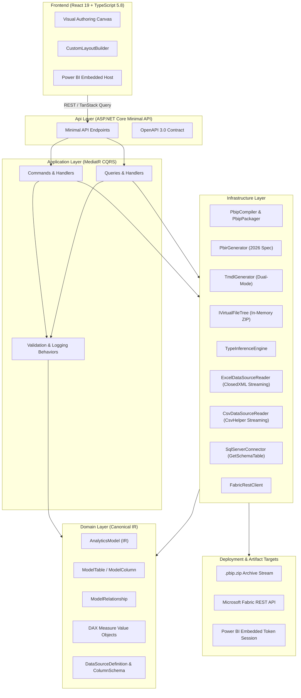

# Enterprise Power BI Analytics Platform

[](https://dotnet.microsoft.com/)
[](https://react.dev/)
[](https://www.typescriptlang.org/)
[](https://learn.microsoft.com/power-bi/developer/projects/projects-overview)
[](#system-architecture)
[-60%2F60%20Passed-success)](#backend-test-taxonomy)
[-12%2F12%20Passed-success)](#frontend-test-taxonomy)

A high-performance, enterprise-grade analytics framework that treats Power BI reports and semantic models as **compiled software artifacts**. Built on .NET 10 LTS and React 19, the platform generates valid 2026 Power BI Enhanced Report Format (`PBIR`), Tabular Model Definition Language (`TMDL`), and complete `.pbip` project packages directly from a canonical C# Intermediate Representation (IR).

---

## Table of Contents

- [System Architecture](#system-architecture)
- [Core Engines & Capabilities](#core-engines--capabilities)
  - [1. Power BI PBIP & TMDL Compiler Engine](#1-power-bi-pbip--tmdl-compiler-engine)
  - [2. Multi-Source Ingestion Engine](#2-multi-source-ingestion-engine)
  - [3. React 19 Visual Authoring Canvas](#3-react-19-visual-authoring-canvas)
- [Monorepo Directory Structure](#monorepo-directory-structure)
- [Clean Architecture & Dependency Rules](#clean-architecture--dependency-rules)
- [API Reference](#api-reference)
- [Testing Taxonomy](#testing-taxonomy)
  - [Backend Test Taxonomy (6 Categories)](#backend-test-taxonomy)
  - [Frontend Test Taxonomy (5 Categories)](#frontend-test-taxonomy)
- [Getting Started](#getting-started)
  - [Prerequisites](#prerequisites)
  - [Backend Setup & Run](#backend-setup--run)
  - [Frontend Setup & Run](#frontend-setup--run)
- [License](#license)

---

## System Architecture



---

## Core Engines & Capabilities

### 1. Power BI PBIP & TMDL Compiler Engine
- **2026 Enhanced Report Format (`PBIR`)**: Generates modular PBIR structures including `definition.pbir`, `definition/report.json` with active themes, `definition/pages/pages.json`, per-page `page.json` with layout bounds, and per-visual `visual.json` with structured `queryState` projection bindings.
- **Dual-Mode TMDL Generator**: Emits `definition.pbism` (v4.0), `definition/model.tmdl`, `definition/relationships.tmdl`, and granular `definition/tables/<table_name>.tmdl`. Supports both full Power Query M partition scripts when data sources are connected and schema-only tabular structures.
- **In-Memory Virtual File Tree**: Employs an `IVirtualFileTree` abstraction that builds full project trees in memory with directory traversal security guards (`..` prevention) and streams `.pbip.zip` archives directly to the client with zero disk I/O contention.

### 2. Multi-Source Ingestion Engine
- **ClosedXML Streaming Reader**: Ingests Excel workbooks in memory-safe batches of 1,000 rows via `IAsyncEnumerable<IReadOnlyList<IDictionary<string, object?>>>`.
- **CsvHelper Streaming Reader**: Non-blocking asynchronous CSV parsing without unbounded memory consumption.
- **Dual-Strategy SQL Schema Extractor**: Primary extraction via `SqlDataReader.GetSchemaTable(CommandBehavior.SchemaOnly)` for instant metadata without data row transfer; automatic fallback to `INFORMATION_SCHEMA.COLUMNS` with parameterized query isolation.
- **Mathematical Type Inference Engine**: Accurately differentiates whole numbers stored in OpenXML IEEE-754 format (`d % 1 == 0`) from fractional decimals, detects ISO-8601 datetimes, booleans, and strings, and captures nullable flags and first 5 distinct sample values.

### 3. React 19 Visual Authoring Canvas
- **Feature-Sliced Design (FSD)**: Strict architectural isolation across `app/`, `features/`, `entities/`, and `shared/` slices.
- **Custom Layout Builder**: Real-time canvas positioning, coordinate calculation, and Power BI layout serialization.
- **Live Embed Token Management**: Seamless integration with the official `powerbi-client` SDK for interactive report rendering.

---

## Monorepo Directory Structure

```
D:\PowerBIEnhanced\
├── .editorconfig                          # Cross-editor formatting standards
├── .gitignore                             # Enterprise ignore rules (.NET 10, Vite, Playwright)
├── CODEOWNERS                             # Code ownership definitions
├── README.md                              # Main platform documentation
├── shared-contracts/
│   └── openapi.yaml                       # Single-source-of-truth OpenAPI 3.0 specification
├── backend/
│   ├── AnalyticsPlatform.slnx             # Modern .NET XML-based solution manifest
│   ├── Directory.Build.props              # Solution-wide compiler & analyzer rules
│   ├── Directory.Packages.props           # Central Package Management (CPM)
│   ├── src/
│   │   ├── AnalyticsPlatform.Domain/      # 0 external deps; Canonical IR entities
│   │   ├── AnalyticsPlatform.Application/ # MediatR commands, queries, validators
│   │   ├── AnalyticsPlatform.Infrastructure/# PBIR/TMDL compiler, connectors, repos
│   │   └── AnalyticsPlatform.Api/         # Minimal API endpoints & OpenAPI mapping
│   └── tests/
│       ├── AnalyticsPlatform.UnitTests/   # Fast isolated domain & handler tests
│       ├── AnalyticsPlatform.IntegrationTests/# WebApplicationFactory API tests
│       ├── AnalyticsPlatform.PathTests/   # End-to-end in-memory workflow tests
│       ├── AnalyticsPlatform.RegressionTests/# Golden schema snapshot tests
│       ├── AnalyticsPlatform.SecurityTests/# Architecture & traversal prevention tests
│       └── AnalyticsPlatform.E2ETests/    # HTTP round-trip system tests
├── frontend/
│   ├── package.json                       # React 19.3 + TypeScript 5.8 + Vite
│   ├── vite.config.ts                     # Vite configuration & path aliases
│   ├── tsconfig.json                      # Strict TypeScript compiler options
│   └── src/
│       ├── app/                           # Application entrypoint & providers
│       ├── features/                      # Business slices (powerbi-embed, data-sources)
│       ├── entities/                      # Business models (dashboards, metrics)
│       └── shared/                        # UI components, HTTP client, utilities
└── infra/
    ├── docker/                            # Production container definitions
    └── k8s/                               # Kubernetes manifests & overlays
```

---

## Clean Architecture & Dependency Rules

The backend strictly adheres to Clean Architecture principles, enforced continuously via automated architecture tests using `NetArchTest.Rules`:

```
┌─────────────────────────────────────────────────────────┐
│                       Api Layer                         │
│               (Composition Root & Endpoints)            │
└────────────────────────────┬────────────────────────────┘
                             │ references
┌────────────────────────────▼────────────────────────────┐
│                   Application Layer                     │
│           (MediatR, Interfaces, CQRS Handlers)          │
└────────────────────────────┬────────────────────────────┘
                             │ references
┌────────────────────────────▼────────────────────────────┐
│                     Domain Layer                        │
│          (0 External Dependencies, Pure C# IR)          │
└─────────────────────────────────────────────────────────┘
                             ▲
                             │ implements interfaces
┌────────────────────────────┴────────────────────────────┐
│                  Infrastructure Layer                   │
│       (PBIP/PBIR, TMDL, Connectors, Repositories)       │
└─────────────────────────────────────────────────────────┘
```

- **Domain Layer (`AnalyticsPlatform.Domain`)**: Contains zero external NuGet package dependencies. Encapsulates `AnalyticsModel`, `ModelTable`, `ModelColumn`, `ModelRelationship`, `Measure`, and `ColumnSchema`.
- **Application Layer (`AnalyticsPlatform.Application`)**: Depends only on Domain. Defines `IVirtualFileTree`, `IPbirGenerator`, `ITmdlGenerator`, `IPbipCompiler`, and `IDataSourceSchemaExtractor`.
- **Infrastructure Layer (`AnalyticsPlatform.Infrastructure`)**: Implements Application interfaces using `ClosedXML`, `CsvHelper`, `Microsoft.Data.SqlClient`, and `Azure.Identity`.
- **Api Layer (`AnalyticsPlatform.Api`)**: Minimal API mapping, Serilog structured logging, and OpenAPI generation.

---

## API Reference

| Method | Route | Description | Request Body | Response |
|---|---|---|---|---|
| `POST` | `/api/powerbi/compile-pbip` | Compiles complete `.pbip` project manifest | `CompilePbipProjectCommand` | `200 OK` (JSON manifest) |
| `POST` | `/api/powerbi/compile-pbip/download` | Compiles and streams `.pbip.zip` archive | `DownloadPbipPackageQuery` | `200 OK` (`application/zip`) |
| `POST` | `/api/powerbi/compile-pbir` | Compiles 2026 PBIR definition files | `CompilePbirDefinitionCommand` | `200 OK` (JSON file collection) |
| `POST` | `/api/powerbi/compile-tmdl` | Compiles TMDL semantic model files | `CompileTmdlSemanticModelCommand` | `200 OK` (TMDL file collection) |
| `POST` | `/api/powerbi/publish` | Publishes dashboard definition to Fabric workspace | `PublishPbipToFabricCommand` | `200 OK` (Deployment status) |
| `GET` | `/api/powerbi/embed-config/{reportId}` | Retrieves embed token & config for client | None | `200 OK` (`EmbedConfig`) |
| `POST` | `/api/data-sources/register` | Registers data source and extracts column schema | `RegisterDataSourceRequest` | `201 Created` (`DataSourceResponse`) |
| `GET` | `/api/data-sources/{id}/schema` | Retrieves extracted column schema by ID | None | `200 OK` (`ColumnSchema[]`) |
| `POST` | `/api/data-sources/sql` | Registers SQL Server connection with schema | `RegisterSqlDataSourceRequest` | `201 Created` (`DataSourceResponse`) |
| `POST` | `/api/data-sources/upload` | Legacy upload and schema extraction endpoint | `UploadDataSourceRequest` | `200 OK` (`DataSourceResponse`) |
| `POST` | `/api/reports/pdf` | Generates high-fidelity vector PDF executive report | `ReportDocumentModel` | `200 OK` (`application/pdf`) |
| `POST` | `/api/reports/excel` | Generates formatted multi-tab Excel spreadsheet | `ReportDocumentModel` | `200 OK` (`application/vnd.openxmlformats...sheet`) |
| `POST` | `/api/reports/word` | Generates formatted Word document report | `ReportDocumentModel` | `200 OK` (`application/vnd.openxmlformats...document`) |
| `POST` | `/api/analytics/measures` | Creates a canonical DAX measure | Measure creation payload | `200 OK` |
| `GET` | `/health/live` | Application liveness health check | None | `200 OK` |

---

## Testing Taxonomy

The platform enforces a comprehensive **6-category test taxonomy** to ensure security, correctness, performance, and backward compatibility.

### Backend Test Taxonomy

```bash
dotnet test backend/AnalyticsPlatform.slnx
```

| Category | Project | Tests | Focus |
|---|---|---|---|
| **Unit** | `AnalyticsPlatform.UnitTests` | 41 | Domain rules, pure functions, CQRS command validators & mocked handlers |
| **Regression** | `AnalyticsPlatform.RegressionTests` | 17 | Golden snapshots for PBIR JSON, TMDL structures, type inference & document headers |
| **Integration** | `AnalyticsPlatform.IntegrationTests` | 17 | `WebApplicationFactory` endpoint round-trips & OpenXml/ClosedXML/QuestPDF generators |
| **Path** | `AnalyticsPlatform.PathTests` | 5 | In-memory end-to-end PBIP compile, multi-source ingestion & document generation |
| **Security** | `AnalyticsPlatform.SecurityTests` | 24 | NetArchTest layer boundaries, traversal guards, Excel formula injection sanitization |
| **E2E** | `AnalyticsPlatform.E2ETests` | 4 | Full HTTP round-trip workflows (compile/download zip, register schema, report export) |
| **Total** | **All 6 Test Projects** | **108 / 108 Passed** | **100% Green, 0 Failures** |

### Frontend Test Taxonomy

```bash
cd frontend && npm run test:all
```

| Category | Command | Tests | Focus |
|---|---|---|---|
| **Unit** | `npm run test:unit` | 3 | Component unit behavior, custom hooks, Redux/Zustand slices |
| **Integration** | `npm run test:integration` | 2 | Power BI embed container interactions, API client adapters |
| **Path** | `npm run test:path` | 2 | Multi-step authoring and multi-source upload workflows |
| **Regression** | `npm run test:regression` | 2 | Visual layout schema contracts and canvas state snapshots |
| **Security** | `npm run test:security` | 3 | XSS sanitization, CSP headers, embed token leakage prevention |
| **Total** | `npm run test:all` | **12 / 12 Passed** | **100% Green, 0 Failures** |

---

## Getting Started

### Prerequisites
- [.NET 10 SDK](https://dotnet.microsoft.com/download/dotnet/10.0) (or latest LTS)
- [Node.js](https://nodejs.org/) `>= 20.x` and `npm` `>= 10.x`
- [Power BI Desktop](https://powerbi.microsoft.com/desktop/) (May 2024 or later with PBIR preview enabled)

### Backend Setup & Run

```bash
# Clone the repository
git clone <repository-url>
cd PowerBIEnhanced

# Restore and build the solution
dotnet restore backend/AnalyticsPlatform.slnx
dotnet build backend/AnalyticsPlatform.slnx

# Run all 60 tests
dotnet test backend/AnalyticsPlatform.slnx

# Launch the API server
dotnet run --project backend/src/AnalyticsPlatform.Api
```

The API will be available at `https://localhost:7148` (or `http://localhost:5000`). OpenAPI specifications can be inspected at `/openapi/v1.json`.

### Frontend Setup & Run

```bash
# Navigate to frontend directory
cd frontend

# Install dependencies (single-pass)
npm install --no-audit

# Run TypeScript type check
npm run typecheck

# Run full frontend test suite
npm run test:all

# Start the Vite development server
npm run dev
```

---

## License

This project is licensed under the MIT License — see the [LICENSE](LICENSE) file for details.
